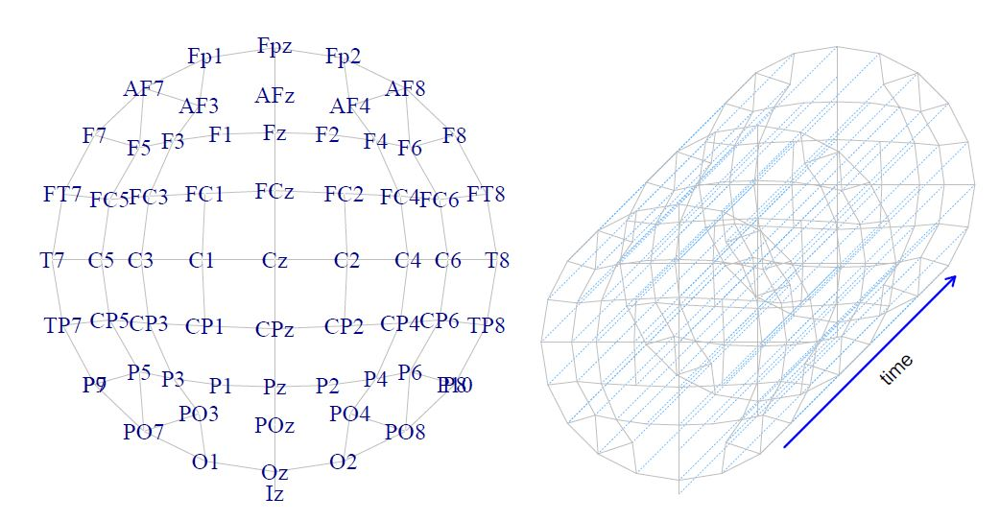

```{r setup, include=FALSE}
knitr::opts_chunk$set(echo = TRUE)
```

# Data

ERP experiment composed by:

- 20 Subjects,
- 32 Channels
- Stimuli: pictures. Conditions:
    1. (f): fear (face)
    2. (h): happiness (face)
    3. (d): disgust (face)
    4. (n): neutral (face)
    5. (o): object

We have one observation for each subject and each stimulus.

```{r}
#devtools::install_github("angeella/ARIeeg")
library(ARIeeg)
library(dplyr)
library(eeguana)
library(ggplot2)
library(tidyr)
library(purrr)
library(abind)
library(permuco4brain)
library(hommel)
```

```{r}
load(system.file("extdata", "data_eeg_emotion.RData", package = "ARIeeg"))
```

We transform the data from eegUtils to eeguana

```{r}
data = utilsTOlst(data=dati)
is_eeg_lst(data)
```

and we drop off the final $5$ channels: 

```{r}
chan_to_rm <- c("RM"  ,  "EOGvo" ,"EOGvu"
                , "EOGhl", "EOGhr")
data <- 
  data %>%
  select(-one_of(chan_to_rm))
```

Finally, we segment the data and select two conditions, i.e., disgust face and object

```{r}
data_seg <- data %>%
  eeg_segment(.description %in% c(3,5),
              lim = c(min(dati$timings$time), max(dati$timings$time))
  ) %>% eeg_baseline()  %>%
  mutate(
    condition =
      description
  ) %>%
  select(-c(type,description))
```

Some plot to understand the global mean difference between the two conditions:

```{r}

data_seg %>%
  select(Fp1,Fp2, F3, F4) %>%
  ggplot(aes(x = .time, y = .value)) +
  geom_line(aes(group = condition))  +
  stat_summary(
    fun = "mean", geom = "line", alpha = 1, size = 1.5,
    aes(color = condition),show.legend = TRUE
  ) +
  facet_wrap(~.key) +
  geom_vline(xintercept = 0, linetype = "dashed") +
  geom_vline(xintercept = .17, linetype = "dotted") +
  theme(legend.position = "bottom")
```

# Analysis

## Multiple testing problem?

The aim is to test the if the brain signal among the two conditions is different from $0$ for each time points, i.e., $500$, and for each channels, i.e., $27$. Therefore, we have $500*2$ statistical tests to perform considering the random subject effect. The multiple testing problem is then obvious, correction method as Bonferroni or similar doesn't capture the time-spatial correlation of the tests, the cluster mass method, proposed by @Maris, is then used. It is based on permutation theory, and it gain some power respect to other procedure correcting at level of spatial temporal cluster instead of at level of single tests. It is similar as concept to the cluster mass in the fMRI framework, but in this case the voxels are expressed in terms of combination time-points/channels. The method is then able to gain some power respect to some traditional conservative FWER correction method exploiting the spatial temporal structure of the data.

## Repeated Measures Anova

The cluster mass method is based on the repeated measures Anova, i.e.,

$$
y = \mathbb{1}_{N \times 1} \mu + X_{\eta} \eta + X_{\pi} \pi + X_{\eta \pi} \eta \pi + \epsilon
$$
where $1_{N \times 1}$ is a matrix with ones and

  1. $\mu$ is the intercept;
  2. $y \in \mathbb{R}^{N \times 1}$ is the response variables, i.e., the **signal**, in our case $N = n_{subj} \times n_{stimuli} = 40$;
  3. $X_{\eta} \in \mathbb{R}^{N \times n_{stimuli}}$ is the design matrix describing the fixed effect regarding the stimuli, and $\eta \in \mathbb{R}^{n_{stimuli} \times 1}$ the corresponding parameter of interest;
  4. $X_{\pi} \in \mathbb{R}^{N \times n_{subj}}$ is the design matrix describing the random effect regarding the subjects, and $\pi \in \mathbb{R}^{n_{subj} \times 1}$ the corresponding parameter.
  5. $X_{\eta \pi}$ is the design matrix describing the interaction effects between subjects and conditions;
  5. $\epsilon \in \mathbb{R}^{N \times 1}$ is the error term with $0$ mean and variance $\sigma^2 I_N$.

Therefore, $y \sim (\mathbb{1}\mu + X_{\eta} \eta, \Sigma)$, $\pi \sim (0, \sigma^2_{\pi} I_{nsubj})$ and $\eta \pi \sim (0,\text{cov}(\eta \pi))$.

We want to make inference on $\eta$, such that $H_0: \eta = 0$ vs $H_1: \eta \ne 0$. We do that using the F statistic, i.e.,

$$
F = \dfrac{y^\top H_{X_{\eta}} y / (n_{stimuli} - 1)}{ y^\top H_{X_{\eta \pi}}y/(n_{stimuli} -1)(n_{subj} -1)} 
$$
where $H_{X}$ is the projection matrix, i.e., $H_{X} = X(X^\top X)^{-1} X^\top$. In order to compute this test, we use an alternative definition of $F$ based on the residuals:

$$
F = \dfrac{r^\top H_{X_{\eta}} r / (n_{stimuli} - 1)}{ r^\top H_{X_{\eta \pi}}r/(n_{stimuli} -1)(n_{subj} -1)} 
$$

where $r = (H_{X_{\eta}} + H_{X_{\eta\pi}})y$. For further details, see @Kherad.

So, let the group of permutation, including the identity transformation, $\mathcal{P}$, we use $r^\star = P r$, where $P \in \mathcal{P}$ to compute the null distribution of our test $\mathcal{R}$ and then the p-value, i.e.,

$$
\text{p-value} = \dfrac{1}{B} \sum_{r^\star_b \in \mathcal{R}} \mathbb{I}(|r^\star_b| \ge |r|)
$$

if the two-tailed is considered.

We have this model for each time point $t \in \{1, \dots, 500\}$ and each channel, so finally we will have $n_{\text{time-points}} \times n_{\text{channels}}$ statistical tests/p-values (raw).
  
## Spatio-temporal Cluster mass 

Then, we need to construct the spatial-temporal clusters in order to correct the raw p-values for the FWER. In this case, we will use the theory of graph, where the vertices represent the channels and the edges represents the adjacency relationship. The adjacency must be defined using prior information, therefore the three-dimensional euclidean distance between channels is used. Two channels are defined adjacent if their euclidean distance is less than a threshold $\delta$, where $\delta$ is the smallest euclidean distance that produces connected graph. This is due to the fact that connected graph implies no disconnected sub-graph. Having sub-graphs implies that some tests
cannot, by design, be in the same cluster, which is not a useful assumption for this analysis. (@Jaromil, @Jaromil1).

Then, we have the spatial adjacency definition, we need to define the temporal one. We reproduce this graph $n_{\text{time-points}}$ times, the edges between all pairs of two vertices (tests) are associated to the same electrode when they are temporally adjacent. The final graph has a total of vertices equals to the number of tests ($n_{\text{channels}} \times n_{\text{time-points}}$). The following figure represents the case of $64$ channels and $3$ temporal measures:



We then delete all the vertices which statistics are below a threshold, e.g. the $95$ percentile of the null distribution of the $F$ statistics. This produces a new graph composed by multiple connected components. Then, each connected component is interpreted as a spatiotemporal cluster. Finally, for each connected component, we compute the cluster-mass statistic using the sum (or sum of squares) of statistics of that particular connected component.


The cluster-mass null distribution is computed by permutations while maintaining spatiotemporal correlations among tests. Permutations must be performed without changing the position of electrodes nor mixing time-points. Concretely, after transforming the responses using the permutation method in @Kherad, they are sorted in a three-dimensional array. It has the design (subjects $\times$ stimuli) in the first dimension, time in the second one and electrodes in the third one. Then, only the first dimension is permuted to create a re-sampled response (or 3D array).
Doing so, it does not reorder time-points, neither electrodes, therefore, the spatiotemporal correlations are maintained within each permuted sample.

# Permuco4brain

In R, all of this is possible thanks to the permuco and permuco4brain packages developed by @Jaromil.

1. Construct the $y$. We need to construct the three-dimensional signal array, having dimensions $40 \times 500 \times 27$:

```{r}
signal <- 
    data_seg%>%
    signal_tbl()%>%
    group_by(.id)%>%
    nest()%>%
    mutate(data = map(data,~as.matrix(.x[-1])))%>%
    pull(data)%>%
    invoke(abind,.,along = 3)%>%
    aperm(c(3,1,2))

dim(signal)
```

2. Construct the $X_{\eta \pi}$:

```{r}
design <- 
  segments_tbl(data_seg)%>%
  select(.subj, condition)
dim(design)
```

3. Construct the graph, using $\delta = 53mm$:

```{r}
graph <- position_to_graph(channels_tbl(data_seg), name = .channel, delta = 53,
                             x = .x, y = .y, z = .z)
plot(graph)
```

4. Define the repeated measures ANOVA formula: 

```{r}
formula <- signal ~ condition + Error(.subj/(condition))
```

Finally, run the main function:

```{r}
model <- permuco4brain::brainperm(formula = formula,
                                  data = design,
                                  graph = graph,
                                  np = 5000,
                                  multcomp = "clustermass",
                                  return_distribution = TRUE)
```

where np indicates the number of permutation.

Then, we can analyze the output:

```{r}
print(model)
```

We have only one significant cluster (32), with p-value equals to $0.0002$ and cluster mass equals to $56102.363567$. It is composed by $27$ channels (the total set), with main channels P8. You can see in details the components of this cluster in

```{r}
names(model$multiple_comparison$condition$clustermass$cluster$membership[which(as.vector(model$multiple_comparison$condition$clustermass$cluster$membership)==11)])
```

You can see the significant cluster (in red) at fixed time points (e.g. 160) using plot:

```{r}
plot(model, samples = 160)
```

and the significant cluster over time and over channels using:

```{r}
image(model)
```

where the significant clusters are represented in a colour-scale and the non-significant one in grey. The white pixels are tests which statistic are below the threshold.

# ARI in EEG cluster mass

However, our significant cluster (11) says only that at least one combination channels/time-points is different from $0$, we don't know how many combinations are significant (spatial specificity paradox). So, we can apply ARI to understand the lower bound of the number of true discovery proportion:

```{r}
ARIeeg(model = model)
```

So, we have at least $16.58\%$ truly active component in the cluster $32$.

# References


    
